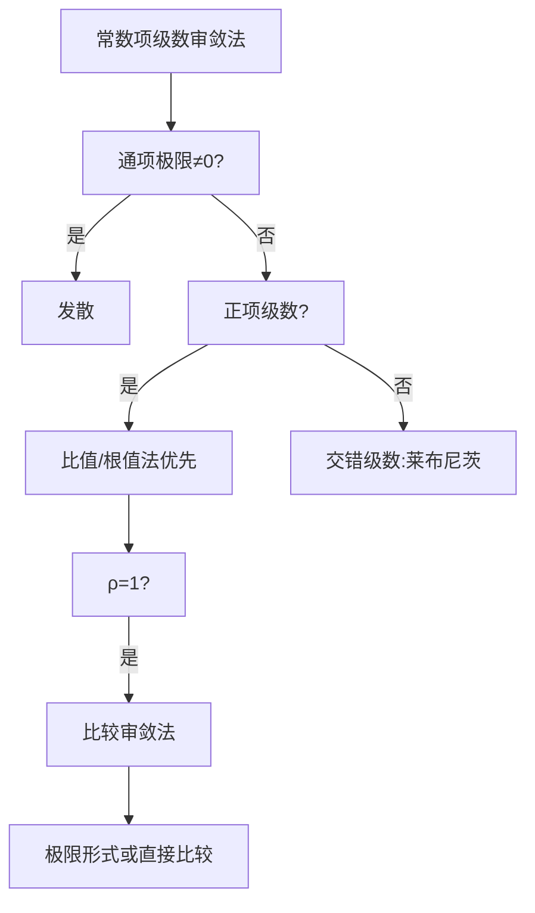

### 1. 收敛与有界的关系定理
>收敛有界<=>有界必收敛

---

### 2. 比较审敛法（有界的体现）
- **核心**：通过比较通项判断敛散性：  
  - 若 $0 \leq a_n \leq b_n$ 且 $\sum b_n$ 收敛，则 $\sum a_n$ 收敛；  
  - 若 $a_n \geq b_n \geq 0$ 且 $\sum b_n$ 发散，则 $\sum a_n$ 发散。  
- **关键工具**：p级数 $\sum \frac{1}{n^p}$（$p>1$ 收敛，$p \leq 1$ 发散）。  
- **适用范围**：需构造已知敛散性的参考级数（如 p级数、几何级数）。
>p=1 为关键点，可以以此为划分函数的增长速度

$$ \frac{1}{\sqrt[3]{n}} > \frac{1}{\sqrt{n}} > \frac{1}{n} > \frac{1}{n^2} > \frac{1}{n^3} $$
---

### 3. 比较审敛法的极限形式（通用方法）
- **内容**：设 $\lim_{n \to \infty} \frac{a_n}{b_n} = L$：  
  - $0 < L < +\infty$：$\sum a_n$ 与 $\sum b_n$ 同敛散；  
  - $L=0$：若 $\sum b_n$ 收敛，则 $\sum a_n$ 收敛；  
  - $L=+\infty$：若 $\sum b_n$ 发散，则 $\sum a_n$ 发散。  
- **常用技巧**：  
  - **抓大头**：保留通项主导项（如 $a_n = \frac{2n^3+1}{5n^4-3} \sim \frac{2}{5n}$）；  
  - **等价无穷小替换**：[[微分常用等价无穷小替换]]
>“比胖子（发散）还胖（大），一定是胖子（发散）”；
>“比瘦子（收敛）还瘦（小），一定是瘦子（收敛）”；
---

### 4. 比值审敛法（达朗贝尔判别法）
- **内容**：计算 $\rho = \lim_{n \to \infty} \left| \frac{a_{n+1}}{a_n} \right|$：  
  - $\rho < 1$：绝对收敛；  
  - $\rho > 1$ 或 $\rho=+\infty$：发散；  
  - $\rho=1$：无法判定（需改用其他方法）。  
- **优先考虑**：适用于含阶乘、指数（如 $n!$、$a^n$）或多项乘积的级数。  
>就是比
$$ n^n > n! > 3^n > 2^n > n^3 > n^2 > n $$
---

### 5. 根值审敛法（柯西判别法）
- **内容**：计算 $\rho = \lim_{n \to \infty} \sqrt[n]{|a_n|}$：  
  - $\rho < 1$：绝对收敛；  
  - $\rho > 1$ 或 $\rho=+\infty$：发散；  
  - $\rho=1$：无法判定。  
- **适用场景**：通项含 $n$ 次幂（如 $a_n = \left( \frac{n}{2n+1} \right)^n$）。  

---

### 6. 极限审敛法
- **内容**：若 $a_n \geq 0$ 且 $\lim_{n \to \infty} n^p a_n = L$：  
  - $p>1$ 且 $L$ 有限：$\sum a_n$ 收敛；  
  - $p \leq 1$ 且 $L>0$（或 $+\infty$）：$\sum a_n$ 发散。  
- **本质**：与 p级数比较的极限形式，适用于通项含对数或复杂因子的级数。  

---

### 方法总结与使用顺序
| **方法**               | **适用范围**                          | **优先级** | **备注**                     |
|-------------------------|---------------------------------------|------------|------------------------------|
| 收敛必要条件           | 所有级数                              | 1          | 快速排除发散                 |
| 比值审敛法             | 含阶乘、指数、乘积项                  | 2          | 优先尝试，计算简便           |
| 根值审敛法             | 通项含 $n$ 次幂                       | 3          | 比值法失效时用               |
| 比较审敛法（极限形式） | 可找到等价或同阶参考级数              | 4          | 需灵活选择 $b_n$             |
| 极限审敛法             | 含对数、复杂因子的正项级数            | 5          | 特殊场景适用                 |
| 直接比较法             | 明显可比较的简单级数（如与 p级数比较）| 6          | 构造不等式需技巧             |

---

### 思维导图要点

