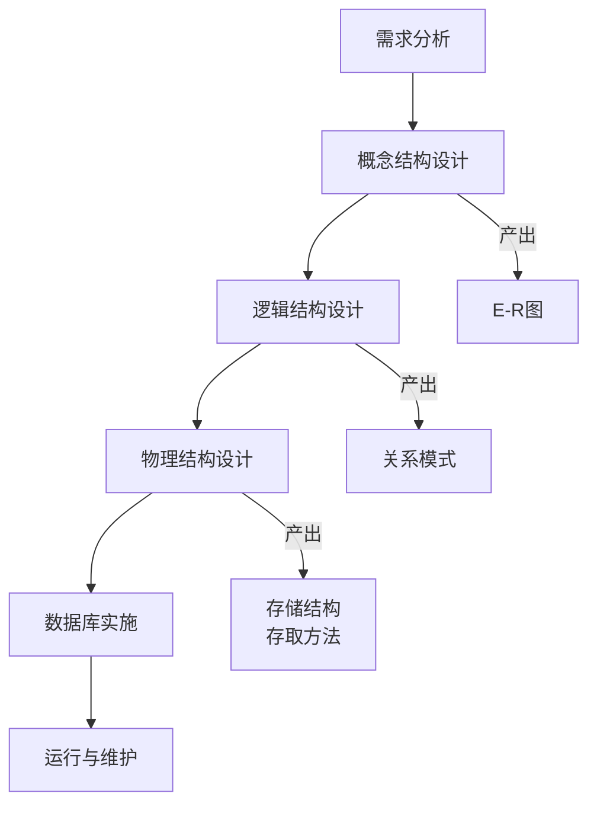

#### **本章学习目标**
掌握数据库设计的六个基本阶段，理解每个阶段的任务、方法和产出物，能够运用所学知识完成一个完整的数据库应用系统的设计。

数据库设计通常分为以下六个阶段，下图清晰地展示了其工作流程和每个阶段的产出：

---

### **`★ 10.1 数据库设计概论`**

-   **数据库设计定义**：对于一个给定的应用环境，构造（设计）最优的数据库**模式**，建立数据库及其应用系统，使之能够有效地存储数据，满足各种用户的应用需求。
-   **设计目标**：满足应用功能需求、具有良好的数据库性能（如响应速度快、空间利用率高）。
-   **基本方法**：遵循上图中的 **“六阶段” 设计流程**，这是一个反复迭代和逐步求精的过程。

---

### **`★★ 10.2 需求分析`**

**任务**：准确了解并分析用户的需求（包括数据与处理）。这是整个设计过程的基础，也是最困难、最耗时的一步。**如果需求分析错误，后续所有工作都可能徒劳。**

-   **主要工作内容**：
    1.  **调查分析**：与用户深入交流，了解业务流程、数据流向、输入/输出信息、安全性和完整性要求。
    2.  **结果表达**：编写**需求规格说明书**。
        -   **数据字典**：描述系统中涉及的**数据**，包括数据项、数据结构、数据流、数据存储等。
            -   *例如：数据项“学号” = {类型: 字符型，长度: 10，别名: 学生编号，取值范围: 0000000001-9999999999}*
        -   **数据流图**：描述系统中**数据处理**的过程。
-   **产出物**：**需求规格说明书**（含数据字典和数据流图）。

---

### **`★★★ 10.3 概念结构设计`**

**任务**：将需求分析得到的用户需求抽象为**信息世界**的概念模型。这个模型应该独立于任何特定的DBMS。**核心工具就是E-R图。**

-   **设计步骤**：
    1.  **抽象局部视图**：对每个用户或应用分组，分别设计其对应的局部E-R图。
    2.  **集成全局视图**：将所有的局部E-R图合并，消除冲突和冗余，生成全局E-R图。
-   **冲突类型**：
    -   **属性冲突**：同一属性在不同局部E-R图中存在类型、取值范围等差异。
    -   **命名冲突**：同名异义（同一名字表示不同对象），异名同义（不同名字表示同一对象）。
    -   **结构冲突**：同一对象在不同应用中具有不同的抽象（如一个作为实体，另一个作为属性）。
-   **产出物**：**全局E-R图**。

---

### **`★★★ 10.4 逻辑结构设计`**

**任务**：将概念模型（E-R图）转换为某个**特定DBMS（如MySQL）所支持的数据模型（关系模型）**，并对其进行优化。

-   **转换规则（E-R图向关系模型的转换）**：这是我们**第二章和第八章**知识的综合应用。
    1.  **一个实体型** -> **一个关系模式**。实体的属性即为关系的属性，实体的码即为关系的码。
    2.  **一个联系** -> **一个关系模式**（具体规则取决于联系的类型，如1:1, 1:n, m:n，详见第二章）。
-   **模式优化**：运用**规范化理论（第八章）** 对生成的关系模式进行审核和优化，使其至少达到第三范式，以减少冗余和操作异常。
-   **设计用户子模式**：根据不同用户群体的需求，定义视图，提供一定程度的数据逻辑独立性和安全性。
-   **产出物**：**一组规范化的关系模式（表结构）清单**。

---

### **`★ 10.5 物理结构设计`**

**任务**：为逻辑数据模型选取一个最适合应用环境的**物理结构**（包括存储结构和存取方法）。**DBA的重要工作。**

-   **主要工作内容**：
    1.  **确定数据的存储结构**：考虑数据的存取时间、空间利用率和维护代价。例如，是否使用压缩技术。
    2.  **设计数据的存取路径**：主要为关系模式选择**索引**（第五章）。例如，为经常出现在 `WHERE` 子句和连接条件中的列建立索引。
    3.  **确定数据的存放位置**：考虑将数据分散存放在不同的硬盘上，以提高I/O效率。
-   **产出物**：**物理数据库设计说明书**（包括索引设计、存储参数设置等）。

---

### **`★ 10.6 数据库实施和维护`**

**任务**：运用DBMS提供的数据定义语言（DDL）和宿主语言，根据逻辑设计和物理设计的结果建立数据库，并组织数据入库。同时，在运行过程中进行维护。

-   **数据库实施**：
    1.  **建立数据库结构**：用DDL（`CREATE DATABASE`, `CREATE TABLE`, `CREATE INDEX`）创建数据库、表、索引等。
    2.  **组织数据入库**：编写数据装载程序，或使用工具将原始数据导入数据库。
    3.  **编写和调试应用程序**。
    4.  **进行试运行**：联合调试应用程序和数据库，检查功能和完善性能。
-   **数据库运行与维护**：
    1.  **数据库的转储和恢复**：定期备份，以便在发生故障时能够恢复。
    2.  **数据库的安全性、完整性控制**：根据用户角色分配权限，实施完整性检查。
    3.  **数据库性能的监督、分析和改进**：监控系统运行性能，调整系统参数（如增加索引）。
    4.  **数据库的重组织和重构造**：当性能下降到一定程度或应用需求发生变化时，需要对数据库进行重组或修改设计。

---

### **本章总结与复习建议**

-   **核心框架**：牢记数据库设计的 **六个阶段** 及其**主要任务和产出物**。这是一个标准化的工程方法。
-   **核心技能**：重点掌握 **需求分析 -> 概念设计（E-R图）-> 逻辑设计（关系模式）** 这个核心链条。这是数据库设计师最主要的工作。
-   **综合应用**：这一章是对前面所有章节（E-R图、关系模型、SQL、规范化、事务）的总结和运用。尝试找一个简单的实际案例（如“图书馆管理系统”、“酒店管理系统”），从头到尾走一遍设计流程，是检验学习效果的最佳方式。

恭喜你，同学！至此，我们已经系统性地梳理了《MySQL数据库原理与应用》课程的全部核心章节。如果你对某个具体阶段或整个课程有任何疑问，或者想进行课程总复习，我随时可以提供帮助。