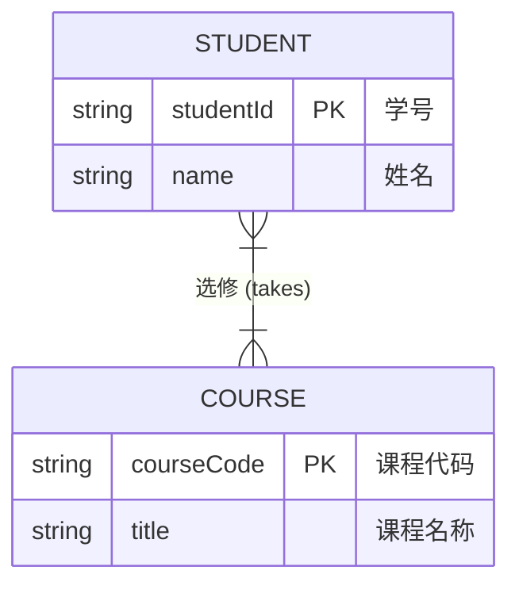

#### **本章学习目标**
理解数据模型的作用和层次，掌握用E-R方法描述现实世界，了解三种主要数据模型的特点，并初步学会如何将概念模型转换为关系模型。

---

### **`★ 2.1 概念模型与数据模型`**

这一节要分清两个不同抽象层次的“模型”。

-   **1. 数据模型的分类（按抽象层次）**
    -   **`概念模型`**：
        -   **面向用户**：也称为信息模型，是**对现实世界的第一层抽象**。
        -   **目的**：按用户的观点来对数据和信息建模，主要用于**数据库设计**。
        -   **工具**：最常用的是 **E-R模型（实体-联系模型）** 和 E-R图。
        -   **`通俗理解`**：就像建筑师在盖楼前，先和客户沟通，画出简单的**概念草图**，说明哪里是卧室，哪里是客厅，满足什么需求，不关心具体砖瓦尺寸。

    -   **`逻辑模型和物理模型`**：
        -   **逻辑模型**：面向数据库管理系统（DBMS），是**对现实世界的第二层抽象**。主要包括**层次模型、网状模型、关系模型（如MySQL）、面向对象模型**等。
        -   **物理模型**：面向计算机系统，描述数据在存储介质上的存储结构和存取方法。是**最低层次的抽象**。
        -   **`通俗理解`**：
            -   **逻辑模型**：建筑师根据概念草图，画出详细的**施工蓝图**，明确每个房间的尺寸、结构。
            -   **物理模型**：施工队根据蓝图，决定用什么样的砖、水泥，电线怎么走等**具体实施方案**。

-   **2. 数据模型的组成要素（任何逻辑模型都包含这三部分）**
    1.  **数据结构**：描述数据库的**组成对象**以及对象之间的**联系**。是**静态特性**。
        -   *例如，在关系模型中，对象是“表”，联系是“表之间的外键关联”。*
    2.  **数据操作**：对数据库中各种对象实例允许执行的**操作集合**。是**动态特性**。
        -   *例如，查询、插入、删除、更新。*
    3.  **数据的完整性约束**：保证数据正确、有效、相容的**规则**。
        -   *例如，年龄不能为负数，学号必须唯一。*

---

### **`★★★ 2.2 概念模型与E-R方法`**

**这是数据库设计的核心，必须熟练掌握E-R图的画法。**

-   **1. 概念模型中的基本概念**
    -   **`实体`**：客观存在并可相互区别的事物。
        -   *例如：一个学生、一门课程、一次考试。*
    -   **`属性`**：实体所具有的某一特性。
        -   *例如：学生的属性有学号、姓名、性别。*
        -   **`关键属性/码`**：能唯一标识一个实体的属性集。如`学号`。
    -   **`实体型`**：用实体名及其属性名集合来抽象和刻画同类实体。如`学生(学号, 姓名, 性别)`。
    -   **`实体集`**：同一类型实体的集合。如`全体学生`。
    -   **`联系`**：实体内部或实体之间的关联。
        -   **`一对一联系`**：对于实体集A中的每个实体，实体集B中至多有一个实体与之联系，反之亦然。
            -   *例如：一个班级只有一个班长，一个班长只属于一个班级。*
        -   **`一对多联系`**：对于实体集A中的每个实体，实体集B中有n个实体与之联系；反之，对于B中的每个实体，A中至多有一个实体与之联系。
            -   *例如：一个班级有多个学生，一个学生只属于一个班级。*
        -   **`多对多联系`**：对于实体集A中的每个实体，实体集B中有n个实体与之联系；反之亦然。
            -   *例如：一个学生可以选修多门课程，一门课程可以被多个学生选修。*

-   **2. E-R图（实体-联系图）的表示方法**
    -   **`矩形`**：表示**实体型**。
    -   **`椭圆形`**：表示**属性**，用无向边将其与相应的实体型连接起来。
    -   **`菱形`**：表示**联系**，框内写明联系名，用无向边分别与有关实体型连接起来，同时在**无向边旁标上联系的类型（1:1, 1:n, m:n）**。
    -   **`示例`**：
- **`示例`**：学生与课程的多对多联系

- `STUDENT { ... }` 和 `COURSE { ... }`: 定义了两个实体及其属性。
- `PK`: 表示 `studentId` 和 `courseCode` 是主键（Primary Key）。
- `"学号"` 等双引号内的文本: 是 Mermaid 支持的属性注释（Comment），用于提供中文含义的说明，不会导致解析错误。
- `STUDENT }|--|{ COURSE : "选修"`: 定义了 `STUDENT` 和 `COURSE` 之间是**多对多**（`}|--|{`）的关系，关系的名称是“选修”。（图片中的文本提到“多对多”联系，使用 `m` 和 `n` 标记，这在 Mermaid 中对应 `}|--|{` 符号）。

        *这是一个典型的“多对多”联系，所以菱形两边都标 `m` 和 `n`，或者不标，默认是多对多。*
---

### **2.3 三种主要的数据模型**

了解它们的特点和优劣，明白为什么**关系模型**成为主流。

-   **1. 层次模型**
    -   **数据结构**：像一棵**倒立的树**，有且仅有一个根节点，其他节点有且仅有一个父节点。
    -   **优点**：结构简单，查询效率高。
    -   **缺点**：只能表示1:n联系，实现m:n联系复杂，查询子女节点必须通过双亲节点，灵活性差。
-   **2. 网状模型**
    -   **数据结构**：像一张**网**，允许一个节点有多个父节点。
    -   **优点**：能直接描述现实世界，性能较好。
    -   **缺点**：结构复杂，不易掌握，DDL和DML语言复杂。
-   **3. `★` 关系模型（重点，MySQL就是关系型数据库）**
    -   **数据结构**：用**二维表**来表示实体和实体间的联系。
    -   **`核心优势`**：
        -   **建立在严格的数学概念基础上**。
        -   **数据结构简单、清晰**，用户易懂易用。
        -   **数据独立性高**。
    -   **这也是我们课程后续学习的核心。**

---

### **`★★ 2.4 数据模型向关系模型的转换`**

**这是将E-R图（概念模型）落地到具体数据库（关系模型）的关键一步。**

转换规则如下：

1.  **`一个实体型`** 转换为 **`一个关系模式`**（即一张表）。
    -   实体的属性就是关系的属性，实体的码就是关系的码。
    -   *例如：实体`学生(学号, 姓名, 性别)` -> 表`学生(学号, 姓名, 性别)`，主键是`学号`。*

2.  **`联系的转换`**（这是难点，分三种情况）：
    -   **`一对一联系`**：可以在**任意一方**的关系模式中，加入**另一方的码**作为**外键**。
        -   *例如：`班级(班号, 班名)` 和 `班长(学号, 姓名)`。可以在`班级`表中加入`班长学号`作为外键，或者在`班长`表中加入`班号`作为外键。*
    -   **`一对多联系`**：在 **“多”的一方**的关系模式中，加入 **“一”的一方的码**作为**外键**。
        -   *例如：`班级(班号, 班名)` 和 `学生(学号, 姓名, ...)`。在`学生`表中加入`班号`作为外键。*
    -   **`多对多联系`**：**必须转换为一个独立的关系模式**。该模式的属性由**相连的各方实体的码**以及**联系本身的属性**构成。关系的码为各实体码的组合。
        -   *例如：`学生(学号, ...)` 和 `课程(课程号, ...)` 之间的“选修”联系，有“成绩”属性。*
        -   **转换结果**：`选修(学号, 课程号, 成绩)`。主键是 `(学号, 课程号)`，它们分别是引用`学生`表和`课程`表的外键。

---

### **本章总结与复习建议**

-   **核心技能**：学会阅读和绘制 **E-R图**。这是数据库设计师的“语言”。
-   **核心转换**：牢牢掌握 **E-R图到关系模式** 的转换规则，尤其是三种联系的转换方法。多做练习题。
-   **理解演变**：明白从**概念模型**（E-R图）到**逻辑模型**（关系表）的设计流程。
